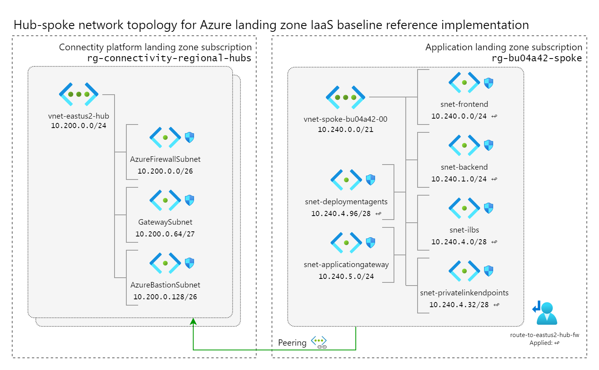

# Azure landing zone IaaS baseline network topology

> Note: This is part of the IaaS baseline reference implementation. For more information see the [readme file in the root](../README.md).

## Hub virtual network

- Location: Connectivity subscription
- CIDR: `10.200.0.0/24`

This regional virtual network hub is meant to hold the following subnets:

- [Azure Firewall subnet]
- [Gateway subnet]
- [Azure Bastion subnet], with reference NSG in place

> Note: For more information about this topology, you can read more at [Azure hub-spoke topology].

### Hub subnet details

| Subnet                | IPs (as deployed)  | IPs (max potential) | CIDR            |
| :-------------------- | -----------------: | ------------------: | :-------------- |
| `GatewaySubnet`       |            dynamic |                [27] | 10.200.0.64/27  |
| `AzureFirewallSubnet` |                  1 |           [57][57f] | 10.200.0.0/26   |
| `AzureBastionSubnet`  |            dynamic |           [57][57b] | 10.200.0.128/26 |

## Spoke virtual network

- Location: Application landing zone subscription
- CIDR: `10.240.0.0/21`

This virtual network spoke is meant to hold the following subnets:

- VMSS frontend and VMSS backend subnets
- Internal Load Balancer subnet
- [Azure Application Gateway subnet]
- [Private Link Endpoint subnet]
- Deployment (or build) agent subnet
- All with NSGs around each

### Spoke subnet details

| Subnet                      | IPs (as deployed)  | IPs (max potential) | CIDR           |
| :-------------------------- | -----------------: | ------------------: | :------------- |
| `snet-frontend`             |                  3 |                 251 | 10.240.0.0/24  |
| `snet-backend`              |                  3 |                 251 | 10.240.1.0/24  |
| `snet-ilbs`                 |                  1 |                  11 | 10.240.4.0/28  |
| `snet-privatelinkendpoints` |                  2 |                  11 | 10.240.4.32/28 |
| `snet-applicationgateway`   |            dynamic |               [251] | 10.240.5.0/24  |
| `snet-deploymentagents`     |                  0 |                  11 | 10.240.4.96/28 |

### Growth

The spoke virtual network was allocated with room for about 2000 IP addresses. This would support additional growth of the solution, and ultimately complete A/B deployment (or recovery deployment) of the above infrastructure if desired with that growth. The spoke is oversized to ensure the application team has room to grow without needing to get more space allocated from the organization's IPAM system. While you shouldn't grab more IPs than are ever expected to be used, always request IP space up front that reflect realistic growth and advanced deployment models.

## Additional considerations

[Private Endpoints] are used for Azure Key Vault, so this Azure service can be accessed using Private Endpoints within the spoke virtual network. There are multiple [Private Link deployment options]; in this implementation they are deployed to a dedicated subnet within the spoke virtual network.

[27]: https://learn.microsoft.com/azure/vpn-gateway/vpn-gateway-about-vpn-gateway-settings#gwsub
[251]: https://learn.microsoft.com/azure/application-gateway/configuration-overview#size-of-the-subnet
[57f]: https://learn.microsoft.com/azure/firewall/firewall-faq#does-the-firewall-subnet-size-need-to-change-as-the-service-scales
[57b]: https://learn.microsoft.com/azure/bastion/configuration-settings#instance
[Private Endpoints]: https://learn.microsoft.com/azure/private-link/private-endpoint-overview#private-endpoint-properties
[Azure hub-spoke topology]: https://learn.microsoft.com/azure/architecture/reference-architectures/hybrid-networking/hub-spoke
[Azure Firewall subnet]: https://learn.microsoft.com/azure/firewall/firewall-faq#does-the-firewall-subnet-size-need-to-change-as-the-service-scales
[Gateway subnet]: https://learn.microsoft.com/azure/vpn-gateway/vpn-gateway-about-vpn-gateway-settings#gwsub
[Azure Application Gateway subnet]: https://learn.microsoft.com/azure/application-gateway/configuration-infrastructure#virtual-network-and-dedicated-subnet
[Private Link Endpoint subnet]: https://learn.microsoft.com/azure/architecture/guide/networking/private-link-hub-spoke-network#networking
[Private Link deployment options]: https://learn.microsoft.com/azure/architecture/guide/networking/private-link-hub-spoke-network#decision-tree-for-private-link-deployment
[Azure Bastion subnet]: https://learn.microsoft.com/azure/bastion/configuration-settings#subnet
